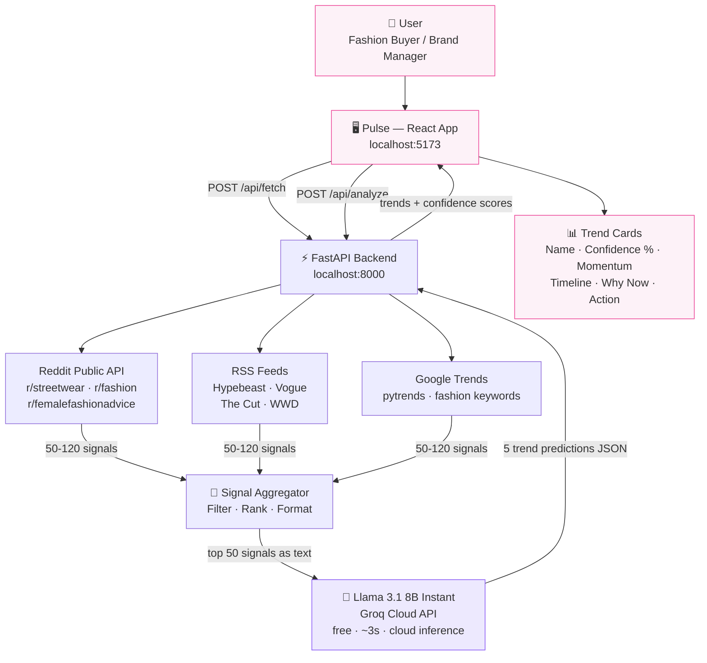

# Pulse — Predictive Fashion Intelligence

Pulse is a GenAI-powered fashion trend forecasting tool that detects what will go mainstream **3–6 months before it does** — by scanning Reddit communities, fashion RSS feeds, and Google Trends in real time.

---

## Problem

Fashion buyers, brand managers, and stylists spend **hours manually browsing** Reddit, Instagram, and trade publications to spot emerging trends. By the time a trend appears in mainstream media, it is already peaking.

## Solution

Pulse automates weak-signal detection: it aggregates hundreds of posts from fashion communities, feeds them to a large language model, and returns 5 ranked trend predictions with confidence scores, momentum labels, and estimated mainstream timelines.

## Target Users

- Independent fashion buyers and stylists
- Emerging brand managers
- Fashion students and trend researchers

---

## Quick Start

### Prerequisites
- Python 3.11+
- Node.js 18+
- Groq API key (free at [console.groq.com](https://console.groq.com)) **or** LM Studio running locally

### 1 — Backend
```bash
cd backend
pip install -r requirements.txt
uvicorn main:app --reload
```
Backend runs at `http://localhost:8000`

### 2 — Frontend
```bash
cd frontend
npm install
npm run dev
```
Frontend runs at `http://localhost:5173`

### 3 — Run a forecast
1. Open `http://localhost:5173`
2. Click **Sources** (top right)
3. Select **Groq Cloud**, paste your API key
4. Pick Reddit presets (e.g. Streetwear + Luxury)
5. Click **run forecast**

---

## Demo

**Video demo (5 min):** [Watch on Google Drive](https://drive.google.com/file/d/1xiQwLtt9Qdaj-13jFjtNtqp0PCRHgN9t/view?usp=sharing)

## Architecture



> See `ARCHITECTURE.md` for full details.

---

## AI Components Disclosure

| Component | Details |
|---|---|
| Foundation Model | Llama 3.1 8B Instant via Groq Cloud API |
| Fallback Model | Phi-3.1-Mini-4K-Instruct via LM Studio (local) |
| Prompt type | Zero-shot structured JSON extraction |
| Data sources | Reddit public JSON API, RSS feeds (Hypebeast, Vogue, The Cut, WWD, Business of Fashion, Refinery29), Google Trends via pytrends |
| AI media tools used | None |

---

## Team

- Francis Gallo — M2 AI, ECE Paris
